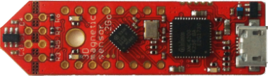

# magsensor-2go — XMC1100-Q024x0064 development projects

Bare-metal projects for the **magsensor-2go** board
(Infineon **XMC1100-Q024x0064**, VQFN24, Cortex-M0).



## Board facts

| Item                | Value                                                        |
| ------------------- | ------------------------------------------------------------ |
| MCU                 | Infineon XMC1100-Q024x0064 (Cortex-M0, VQFN24)            |
| Flash               | 64 KB at `0x10001000` (sector 0 is the boot/config area)     |
| SRAM                | 16 KB at `0x20000000`, no heap (stack = `BOARD_STACK_SIZE`, 3 KB default) |
| Clock               | DCO1 = 64 MHz → MCLK = 32 MHz, PCLK = 64 MHz, 1 flash wait state |
| LED1 / LED2         | `P1.0` / `P1.1`, **active high**                              |
| Console             | USIC0 channel 0, TXD = `P2.1` (ALT6), RXD = `P2.2`, 115200 8N1 |
| Debug / programming | J-Link (SWD); console on the J-Link-Lite VCP COM port        |
| Die temperature     | `SCU_ANALOG->ANATSEMON`, OTP-calibrated (see `board/tse.c`)  |

The console pins are also where the DFP's own `XMC_GPIO_Init()`-style pad setup
would leave the pads **disabled** (`PORT2->PDISC` resets to `0xFFFF`), so
`board/console.c` explicitly clears the `P2.1`/`P2.2` bits before enabling the
alternate function. Only `PORT2` needs this: its pads are the analog-capable
ones. `PORT0`/`PORT1` `PDISC` reads as 0 and is **not** writable — a write to it
raises a HardFault, which is why the DFP header declares those fields `__I`.

## Board connections

Pin-level connections are in [`board-connections.md`](board-connections.md),
including two corrections to the published board document (LED1 is on `P1.0`,
not `P0.12`; the sensor's VDD is on board power, not `P1.0`).

## Clock tree (32 MHz MCLK / 64 MHz PCLK)

`board/system_xmc1100.c` runs from the DFP startup file *before* `main()`:

1. one flash wait state (`NVM->NVMCONF` + `FIXWS`),
2. `SCU_CLK->CLKCR = 0x3FF10100` (IDIV = 1, FDIV = 0 → fractional divider
   bypassed → MCLK = DCO1/2 = 32 MHz; PCLK is hardware-fixed at 2 × MCLK = 64 MHz
   on XMC1),
3. `SysTick` is clocked from MCLK by `board_init()`.

`board_cpu_frequency_hz()` / `board_peripheral_clock_hz()` return the values
derived from `SCU_CLK->CLKCR`, so applications print the real runtime clocks
rather than a hard-coded number.

## Projects (`bare/`)

`bare/` holds the sample projects for this board. They use the board layer
directly — no RTOS, no HAL above `board/`. See
[`bare/README.md`](bare/README.md) for the project list.

## Build / flash / serial console

Toolchains: GNU `arm-none-eabi-gcc` (default) or Keil AC6 `armclang`
(`-DXMC_TOOLCHAIN=armclang`). Device + CMSIS headers come from the repo-root
`drivers/` (see the root README).

```bash
cd bare/<project>

bash build.sh                 # configure + build with gcc into build/
ninja -C build flash          # program through J-Link (SWD), then reset+run

# Keil AC6 (separate build dir: CMAKE_TOOLCHAIN_FILE is cached)
cmake -G Ninja -S . -B build-ac6 -DXMC_TOOLCHAIN=armclang
ninja -C build-ac6
```

Open the J-Link VCP COM port at **115200 8N1** and reset the board to see the
program's console output.

Other useful targets: `ninja flash-bin` (raw `.bin` at `0x10001000`),
`ninja erase`. J-Link settings can be overridden with `-DJLINK_DEVICE=…`,
`-DJLINK_IF=…`, `-DJLINK_SPEED=…`.