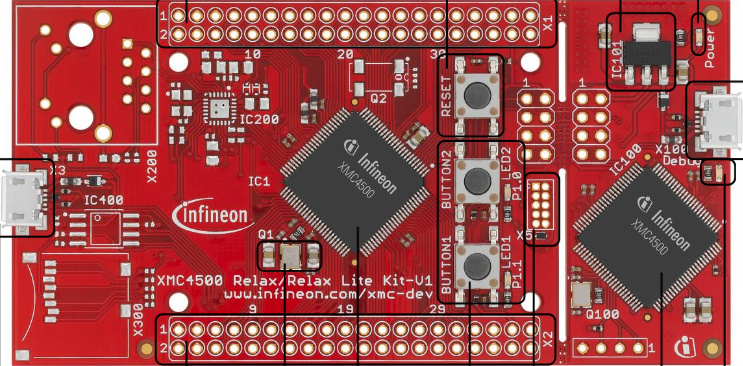

# xmc4500-relax-lite — XMC4500-F100x1024 development projects

Bare-metal projects for the **xmc4500-relax-lite** board
(Infineon **XMC4500-F100x1024**, LQFP-100, Cortex-M4F).



## Board facts

| Item                | Value                                                          |
| ------------------- | -------------------------------------------------------------- |
| MCU                 | Infineon XMC4500-F100x1024 (Cortex-M4F, LQFP-100)              |
| Flash               | 1024 KB at `0x08000000` (cached) / `0x0C000000` (uncached)     |
| SRAM                | 64 KB PSRAM `0x10000000` + 64 KB DSRAM1 `0x20000000` + 32 KB DSRAM2 `0x30000000`; stack in PSRAM_1 |
| Clock               | 12 MHz crystal → PLL → fCPU = fSYS = 120 MHz, fPB = 120 MHz, FPU enabled |
| LED1 / LED2         | `P1.0` / `P1.1`, **active high**                               |
| Console             | USIC1 channel 0, TXD = `P0.5` (ALT2 / DOUT0), RXD = `P0.4` (DX0A), 115200 8N1 on the external COM bridge |
| Debug / programming | J-Link (SWD)                                                   |
| Internal analog     | die temperature sensor (DTS), EVR13 and EVR33 supply monitors (XMClib SCU) |

`P0.4`/`P0.5` are plain digital pads (PORT0 is not an analog-capable port on
XMC4500), so no `PDISC` handling is needed: the pads are driven by their `IOCR`
alternate function and the input is selected directly in `USIC1_CH0.DX0CR`.

## Board connections

Pin-level connections are in [`board-connections.md`](board-connections.md).

## Expansion headers (X1 / X2)

Signals are listed top-to-bottom in header order; each row is the two pins of one
row (left pin, then right pin).

### X1

| Pin (left) | Pin (right) |
| ---------- | ----------- |
| GND        | GND         |
| GND        | GND         |
| GND        | RST#        |
| P2.1       | P2.10       |
| P2.14      | P14.8       |
| P2.15      | P14.9       |
| VAREF      | P14.0       |
| P14.1      | P14.2       |
| P14.3      | P14.4       |
| P14.5      | P14.6       |
| P14.7      | P14.12      |
| P14.13     | P14.14      |
| P14.15     | P15.2       |
| P15.3      | HIB_0       |
| HIB_1      | P3.0        |
| P3.1       | P3.2        |
| P0.9       | P0.1        |
| P0.10      | P0.0        |
| V33        | V33         |
| V50        | V50         |

### X2

| Pin (left)             | Pin (right)           |
| ---------------------- | --------------------- |
| GND                    | GND                   |
| GND                    | GND                   |
| P2.6                   | P5.7                  |
| P5.2                   | P5.1                  |
| P5.0                   | P1.15                 |
| P1.14                  | P1.13                 |
| P1.12                  | P1.11                 |
| P1.10                  | P1.5                  |
| P1.4                   | P1.3                  |
| P1.2                   | P1.1                  |
| P1.0                   | P1.9                  |
| P1.8                   | P0.8                  |
| P0.7                   | P3.4                  |
| P3.3                   | P0.12                 |
| P0.11                  | P0.6                  |
| P0.5 (debug UART)      | P0.2                  |
| P0.3                   | P0.4 (debug UART)     |
| GND                    | GND                   |
| V33                    | V33                   |
| V50                    | V50                   |

Note: `P0.4` (RXD) and `P0.5` (TXD) are the debug console UART — see the
[`eink_154`](bare/eink_154) project for an e-paper module wired to X2.

## Clock tree (120 MHz)

`board/system_XMC4500.c` (vendored from the DFP, version V3.1.7) runs from the
DFP startup file *before* `main()`:

1. relocates the vector table, enables the FPU (`CPACR`) and sets the flash wait
   states,
2. starts the 12 MHz crystal (`OSCHP_FREQUENCY = 12000000`) and ramps the main
   PLL up (`PDIV = 1`, `NDIV = 79`, `K2DIV = 3`) to fSYS = 120 MHz,
3. `SystemCoreClockUpdate()` derives `SystemCoreClock` from the PLL registers.

`board_cpu_frequency_hz()` returns `SystemCoreClock` (fCPU = 120 MHz) and
`board_peripheral_clock_hz()` derives fPB from `SCU_CLK->PBCLKCR`, so
applications print the real runtime clocks rather than a hard-coded number.

## Projects (`bare/`)

`bare/` holds the sample projects for this board. They use the board layer
directly — no RTOS, no HAL above `board/`. See
[`bare/README.md`](bare/README.md) for the project list.

## Build / flash / serial console

Toolchains: GNU `arm-none-eabi-gcc` (default) or Keil AC6 `armclang`
(`-DXMC_TOOLCHAIN=armclang`). Device + CMSIS headers come from the repo-root
`drivers/` (see the root README), and the small slice of XMClib needed for the
temperature / EVR readings is compiled from `drivers/xmc4/XMClib/src/xmc4_scu.c`.

```bash
cd bare/<project>

bash build.sh                 # configure + build with gcc into build/
ninja -C build flash          # program through J-Link (SWD), then reset+run

# Keil AC6 (separate build dir: CMAKE_TOOLCHAIN_FILE is cached)
cmake -G Ninja -S . -B build-ac6 -DXMC_TOOLCHAIN=armclang
ninja -C build-ac6
```

Open the onboard debugger VCOM COM port at **115200 8N1** and reset the board to
see the program's console output.

Other useful targets: `ninja flash-bin` (raw `.bin` at `0x08000000`),
`ninja erase`. J-Link settings can be overridden with `-DJLINK_DEVICE=…`,
`-DJLINK_IF=…`, `-DJLINK_SPEED=…`.
